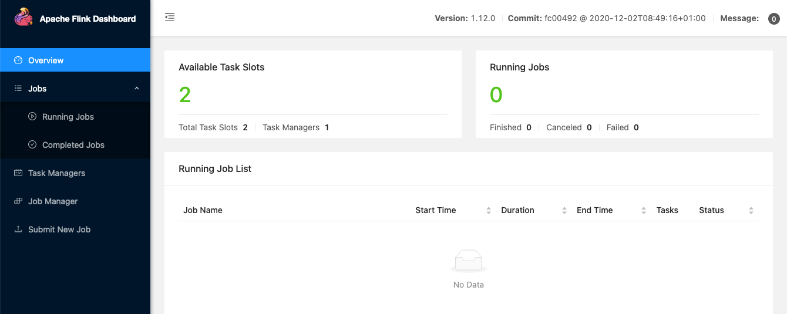

# Apache Flink pure SQL Cli Image

This docker-compose provides a Flink SQL CLI image updated to the 1.12.0 version. It's inspired by [this](https://github.com/wuchong/flink-sql-demo/tree/v1.11-EN/sql-client).

It makes use of the `flink:1.12.0-scala_2.11` images and of the `ftisiot/flink-sql-client:1.12.0` which is based on the same `flink:1.12.0-scala_2.11` image.

The `sql-client` service maps a `~/kafkacerts/` folder to `/certs` which can be used to create and pass files like Keystores when SSL authentication is needed (e.g. with Apache Kafka).

## Usage

You need both [docker](https://docs.docker.com/engine/install/) and [docker-compose](https://docs.docker.com/compose/install/) installed.

Clone the current repository, navigate to the `flink-sql-cli` folder, then execute

```
docker-compose up -d
```

This will start the 3 nodes Flink cluster, to check which nodes are available use

```
docker-compose ps
```

The result should be similar to the below

```
Name                      Command               State                Ports              
-----------------------------------------------------------------------------------------------
flink_jobmanager_1    /docker-entrypoint.sh jobm ...   Up      6123/tcp, 0.0.0.0:8081->8081/tcp
flink_sql-client_1    /docker-entrypoint.sh            Up      6123/tcp, 8081/tcp              
flink_taskmanager_1   /docker-entrypoint.sh task ...   Up      6123/tcp, 8081/tcp              
```

Apache Flink Web UI is now available at `localhost:8081`




To Access the SQL CLI, execute

```
docker ps
```

And take note of the `CONTAINER_ID` related to the `ftisiot/flink_sql_cli:1.12.0` image (`af00e6ef943f` in the below example)

```
CONTAINER ID   IMAGE                          COMMAND                  CREATED         STATUS         PORTS                              NAMES
af00e6ef943f   ftisiot/flink_sql_cli:1.12.0   "/docker-entrypoint.…"   2 minutes ago   Up 2 minutes   6123/tcp, 8081/tcp                 flink_sql-client_1
22a459232385   flink:1.12.0-scala_2.11        "/docker-entrypoint.…"   2 minutes ago   Up 2 minutes   6123/tcp, 8081/tcp                 flink_taskmanager_1
8b4d5c087800   flink:1.12.0-scala_2.11        "/docker-entrypoint.…"   2 minutes ago   Up 2 minutes   6123/tcp, 0.0.0.0:8081->8081/tcp   flink_jobmanager_1
```

Now execute the following code to enter the docker container in interactive mode

```
docker exec -it <CONTAINER_ID> /bin/bash
```

Finally execute

```
./sql-cli.sh
```

This will popup Flink sql cli

```
Reading default environment from: file:/opt/flink/conf/sql-client-conf.yaml
No session environment specified.

Command history file path: /root/.flink-sql-history
                                   ▒▓██▓██▒
                               ▓████▒▒█▓▒▓███▓▒
                            ▓███▓░░        ▒▒▒▓██▒  ▒
                          ░██▒   ▒▒▓▓█▓▓▒░      ▒████
                          ██▒         ░▒▓███▒    ▒█▒█▒
                            ░▓█            ███   ▓░▒██
                              ▓█       ▒▒▒▒▒▓██▓░▒░▓▓█
                            █░ █   ▒▒░       ███▓▓█ ▒█▒▒▒
                            ████░   ▒▓█▓      ██▒▒▒ ▓███▒
                         ░▒█▓▓██       ▓█▒    ▓█▒▓██▓ ░█░
                   ▓░▒▓████▒ ██         ▒█    █▓░▒█▒░▒█▒
                  ███▓░██▓  ▓█           █   █▓ ▒▓█▓▓█▒
                ░██▓  ░█░            █  █▒ ▒█████▓▒ ██▓░▒
               ███░ ░ █░          ▓ ░█ █████▒░░    ░█░▓  ▓░
              ██▓█ ▒▒▓▒          ▓███████▓░       ▒█▒ ▒▓ ▓██▓
           ▒██▓ ▓█ █▓█       ░▒█████▓▓▒░         ██▒▒  █ ▒  ▓█▒
           ▓█▓  ▓█ ██▓ ░▓▓▓▓▓▓▓▒              ▒██▓           ░█▒
           ▓█    █ ▓███▓▒░              ░▓▓▓███▓          ░▒░ ▓█
           ██▓    ██▒    ░▒▓▓███▓▓▓▓▓██████▓▒            ▓███  █
          ▓███▒ ███   ░▓▓▒░░   ░▓████▓░                  ░▒▓▒  █▓
          █▓▒▒▓▓██  ░▒▒░░░▒▒▒▒▓██▓░                            █▓
          ██ ▓░▒█   ▓▓▓▓▒░░  ▒█▓       ▒▓▓██▓    ▓▒          ▒▒▓
          ▓█▓ ▓▒█  █▓░  ░▒▓▓██▒            ░▓█▒   ▒▒▒░▒▒▓█████▒
           ██░ ▓█▒█▒  ▒▓▓▒  ▓█                █░      ░░░░   ░█▒
           ▓█   ▒█▓   ░     █░                ▒█              █▓
            █▓   ██         █░                 ▓▓        ▒█▓▓▓▒█░
             █▓ ░▓██░       ▓▒                  ▓█▓▒░░░▒▓█░    ▒█
              ██   ▓█▓░      ▒                    ░▒█▒██▒      ▓▓
               ▓█▒   ▒█▓▒░                         ▒▒ █▒█▓▒▒░░▒██
                ░██▒    ▒▓▓▒                     ▓██▓▒█▒ ░▓▓▓▓▒█▓
                  ░▓██▒                          ▓░  ▒█▓█  ░░▒▒▒
                      ▒▓▓▓▓▓▒▒▒▒▒▒▒▒▒▒▒▒▒▒▒▒▒▒▒▒▒▒▒░░▓▓  ▓░▒█░

    ______ _ _       _       _____  ____  _         _____ _ _            _  BETA   
   |  ____| (_)     | |     / ____|/ __ \| |       / ____| (_)          | |  
   | |__  | |_ _ __ | | __ | (___ | |  | | |      | |    | |_  ___ _ __ | |_
   |  __| | | | '_ \| |/ /  \___ \| |  | | |      | |    | | |/ _ \ '_ \| __|
   | |    | | | | | |   <   ____) | |__| | |____  | |____| | |  __/ | | | |_
   |_|    |_|_|_| |_|_|\_\ |_____/ \___\_\______|  \_____|_|_|\___|_| |_|\__|

        Welcome! Enter 'HELP;' to list all available commands. 'QUIT;' to exit.


Flink SQL>
```
